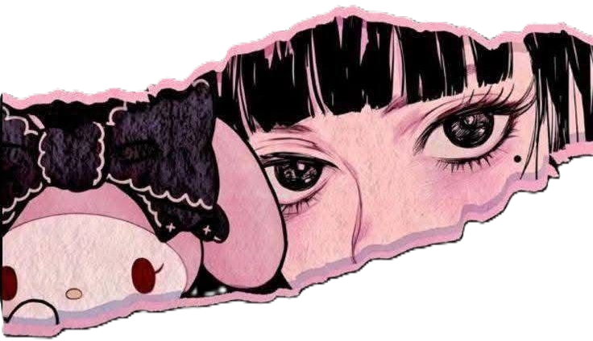
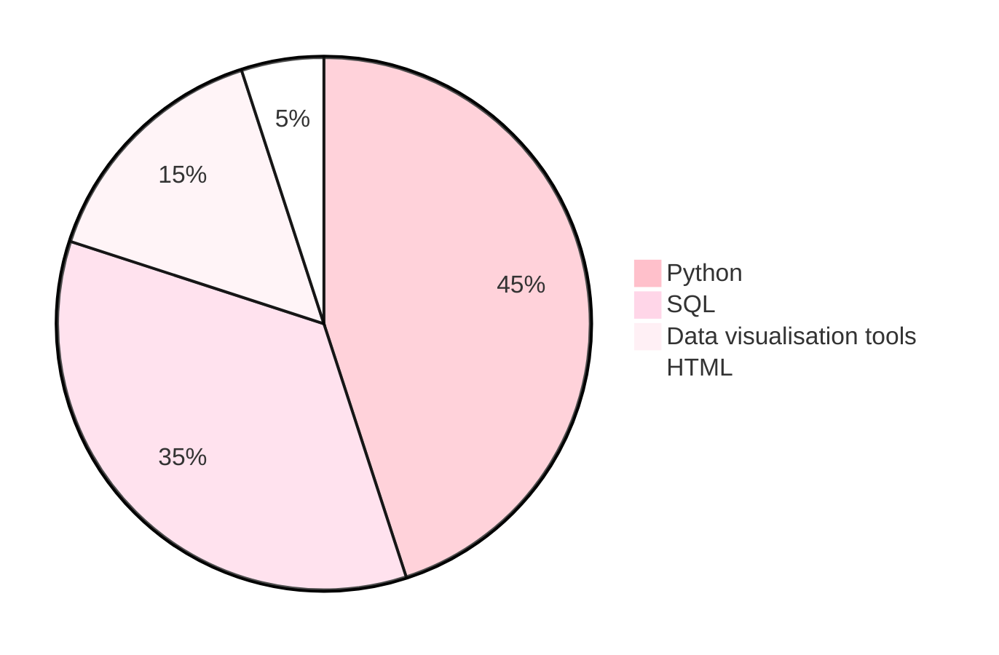

# About me
         

 

﹉﹉﹉﹉﹉୨♡୧﹉﹉﹉﹉﹉﹉﹉﹉﹉﹉୨♡୧﹉﹉﹉﹉﹉﹉﹉﹉﹉﹉୨♡୧﹉﹉﹉﹉﹉﹉﹉﹉﹉﹉୨♡୧﹉﹉﹉

┈ ┈ ┈ ┈ ୨♡୧ ┈ ┈ ┈ ┈┈ ┈ ┈ ┈ ୨♡୧ ┈ ┈ ┈ ┈┈ ┈ ┈ ┈ ୨♡୧ ┈ ┈ ┈ ┈┈ ┈ ┈ ┈ ୨♡୧ ┈

### <b>Hi,</b>

I drink too much tea and I like to play with data.
I have experience with clinical research related bioinformatics, including software backend development and creating databases.
I hold a BSc in Animal Science.

      

### My favourite tools

> ### Personal Dashboard
> 
> | Hobby | % Time spent | Notes |
> |--------|-------------|-------|
> | Art | 10% | Pixel and traditional art |
> | Bioinformatics | 5% | Molecular biosciences |
> | Fitness | 25% | Gym and pilates |
> | Photography | 5% | I like object-oriented :) photos |
> | Gaming | 65% | PoE2, Hello Kitty Island Adventure, OSRS |
